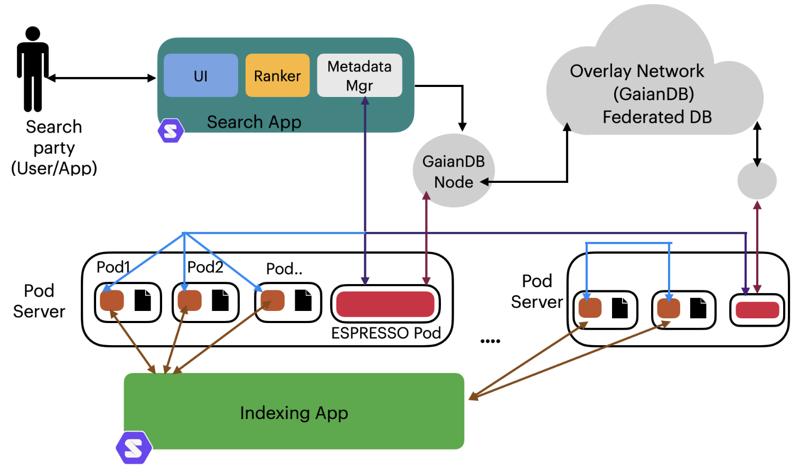

# Exploring the Performance of Scalable Keyword Search on Decentralized Data with Differential Visibility Constraints

## Overview

This repository contains the source code, data, and supplementary materials for our paper submitted to the **VLDB 2025 Conference**. Our work investigates scalable keyword search and querying in **decentralized data cooperatives** with differential data access. We focus on:

- **Decentralized indexing mechanisms** that respect differential visibility constraints.
- **Metadata-driven source selection** for query efficiency and privacy.
- **Decentralized ranking techniques** to optimize search results.
- **Experimental evaluation** in a healthcare-inspired decentralized personal data setting.

## Key Contributions

- **Decentralized Search Framework**: We design a privacy-aware, decentralized keyword search mechanism using metadata-driven query processing.
- **Differential Access Control**: The system ensures that search results respect access permissions set by data store owners.
- **Scalability and Efficiency**: Our experiments demonstrate that **metadata-driven search significantly reduces execution time while maintaining retrieval quality comparable to centralized methods**.
- **Real-World Inspired Deployment**: We test our approach in a **federated healthcare data network**, evaluating performance trade-offs between efficiency, privacy, and scalability.

## Architecture Overview

The architecture of our ESPRESSO framework consists of four main components:
1. **Indexing app** - A Solid application that indexes data stores and maintains pod indexes.
2. **Search app** - Performs searches across Solid servers’ pods.
3. **Overlay network** - Connects multiple Solid servers hosting data stores.
4. **Metadata manager** - Keeps the source selection metadata up-to-date.

<!-- ## Experimental Setup

Our experiments simulate a **decentralized federated health data network**, where patients' medical records are stored in **Personal Online Data Stores (Pods)** hosted on **Solid servers**. The experimental configuration includes:

- **50 Solid servers**, each hosting **9,500 pods** (~475,000 pods in total).
- **Synthetic healthcare dataset** generated using **Synthea**.
- **Differential access control** assigned to search parties (ranging from 5% to 100% access levels).
- **Search engine** implemented using **Apache Lucene**.
- **Decentralized ranking mechanism** leveraging **BM25 and metadata-aware ranking**. -->

## Implementation Details

- **Decentralized Indexing**: Each pod maintains **search-party-specific indexes**, ensuring visibility constraints are respected.
- **Metadata for Source Selection**:
  - **System-Level Metadata**: Helps in selecting relevant servers.
  - **Server-Level Metadata**: Helps in selecting relevant pods.
  - **Bloom Filters**: Used for privacy-preserving metadata disclosure.
- **Query Execution Process**:
  1. Selecting relevant servers based on **system-level metadata**.
  2. Selecting relevant pods within each server based on **server-level metadata**.
  3. Fetching results from indexed personal data stores (pods).
  4. Aggregating and ranking results based on **BM25 scoring**.
## Repository Structure

📂 SourceCode/           # Source code for indexing, search, and query processing  
  
📂 Figs-Plots/           # Figures and Experiments Plots  
  
📂 dataset/              # Sample dataset  
  
📂 docs/                 # Paper Appendix, results, and other supplementary materials  
  
📜 README.md             # Project overview and setup instructions  
  
📜 requirements.txt      # Dependencies for running the code 

### Prerequisites
- Node.js with `Axios` for HTTP requests
- Apache Lucene for indexing
- Community Solid Server (CSS) for decentralized data stores
- Python (optional) for metadata processing and Bloom filter evaluation

### Citation
If you use this code or dataset in your research, please cite our paper:

@article{ragab2025exploring,
  author    = {Mohamed Ragab and Helen Oliver and Mohammad Bahrani and Alexandra Poulovassilis and Thanassis Tiropanis and Adriane Chapman and George Roussos},
  title     = {Exploring the Performance of Scalable Keyword Search on Decentralized Data with Differential Visibility Constraints},
  journal   = {PVLDB},
  year      = {2025},
  volume    = {14},
  number    = {1},
  pages     = {XX-XX},
  doi       = {XX.XX/XXX.XX}
}
